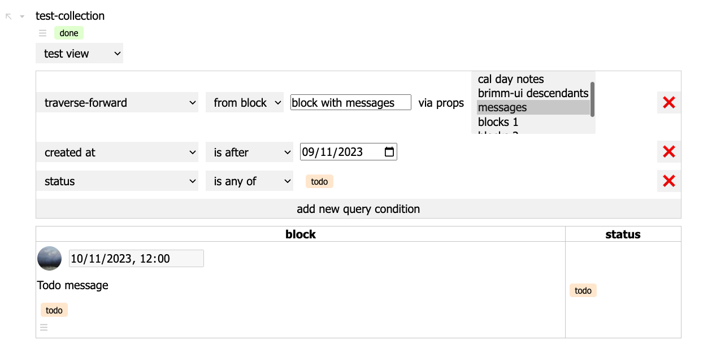
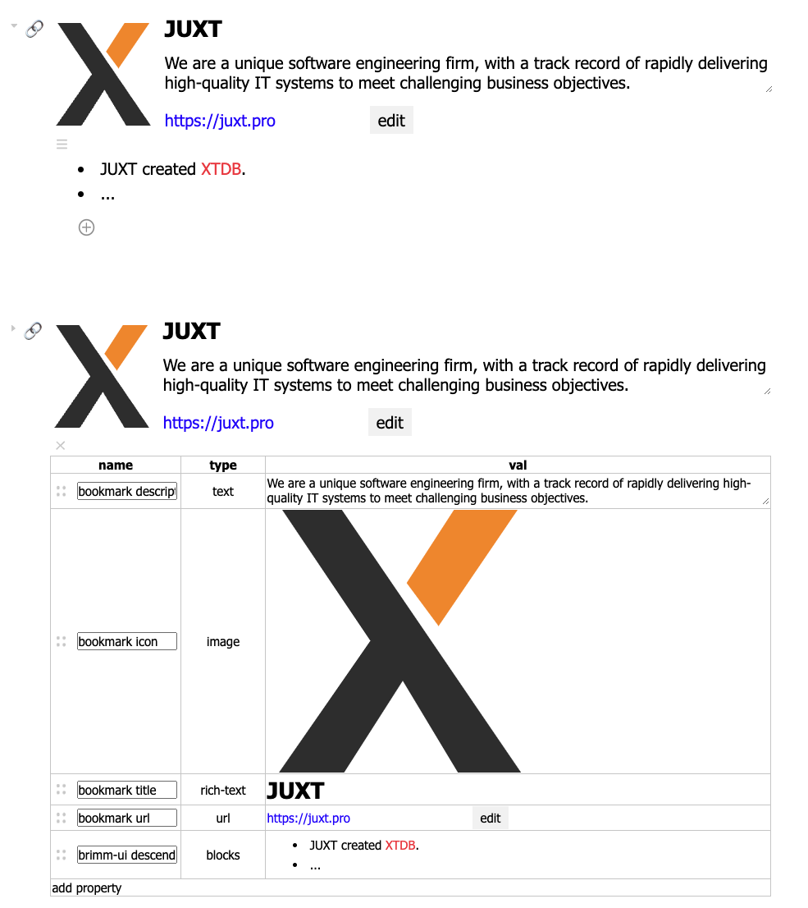

# Brimm

## What

The shortest path to understanding **Brimm** is to understand its primary motivation: to combine Notion’s database and document editing experience with the structural flexibility of infinite outliners (apps like Workflowy or Logseq).

Brimm lets you model data as blocks of many shapes (text, tasks, bookmarks, personal info, events, books, music albums, contact info, etc.), categorise and organise it, make connections, and search across it. You can mark a block as todo anywhere, then create a table listing all todos due today, whether from your entire database or a single project. You can list all paragraphs in need of revision from a blog post you’re writing. Or create a gallery of your favourite grunge albums.

> [!TIP]
> You can see Brimm in action in this [early 5-minute demo](https://www.youtube.com/watch?v=8fgIwCQHMRg).

Brimm is a full-stack web app, with the backend under the user’s control. Unlike Notion, you own your data. Brimm will be open source across the stack.

The broader vision for Brimm is to provide you with a capable personal/team graph database with a default UI. While the default interface covers many use cases, you *should* be able to work with your data through other interfaces/applications.

Brimm is in active development, with a public release planned for Q1 2024.

## Why

Notion features a beautiful document editing experience and its databases are a great tool for modelling and managing structured data. However, in my experience, Notion is not flexible enough for complex work – the document structure is not sufficiently granular. Additionally, pages can have properties only if they live in a Notion database which silos your data: you cannot mark a paragraph inside a document as todo nor could you get a table view of all of todos across your workspace.

Outliners excel at matching your thought flow, nesting and linking providing a robust way of structuring your data.

When I started thinking about this and building Brimm, I wasn’t aware of any applications that combined these features. This is no longer quite true: Tana has a somewhat similar core design and Logseq has enabled adding properties to its blocks, to name a few I’m familiar with.

Here is what Brimm brings to the table.

### Going beyond outliners and documents

The “graph of nodes with properties” structure can model many kinds of data and this is one thing I wish to lean into with Brimm. As a starting point, Brimm recognises that the information we work with comes in many shapes: text, tasks, bookmarks, contact info, events, books, music albums and so on.

Beyond that, I think interfaces/features like those of, say, Reddit or Twitter can be naturally modelled with this architecture. For instance, hosting Brimm’s documentation, project management and forums through the default Brimm UI (enabling situated discussions and transparent references to what is being discussed) seems within reach.

### Embracing the backend

I see a lot of benefits to making your personal or team data accessible through various applications. For example:

- Even though you should be able to publicly expose your default Brimm application, you might instead wish to use the default UI as a sort of headless CMS, while rendering your data as a static website. (WordPress, personal blogs, digital gardening.)
- You might create a simple scheduler UI, inserting appointments as blocks in Brimm, then view them through a calendar UI (or Brimm UI itself).
- Archive, categorise and search data from external APIs in a single place (e.g. email).

### Placing the user in control

Open source across the stack. Brimm can run entirely locally on your machine. If I were to stop supporting Brimm, you could continue using it without needing to migrate to another app. (If you do want to migrate, being completely in control will help you do that.) Being open source also increases the likelihood of community maintenance (and extension).

The user being in control also means being able to manipulate their data in various ways, as some of the examples below will show.

## How

Here’s how Brimm achieves some of its goals.

### Modelling data with blocks and properties

The two fundamental entities in Brimm are **properties** and **blocks**.

- Properties model individual pieces of data (the release date, the band, the genres, the songs), defining the type of their values (a date, a reference to a block, multiple enumerated values, nested blocks).
- Blocks bring coherent pieces of data together (the album).

From this perspective, the standard outliner note is simply a block with a text property and a property pointing to notes nested within it. However, other kinds of data needn’t have these properties nor the same visual representation.

In Brimm, you can add arbitrary properties to a block and define how these properties are laid out in the UI. You can create **block types** that group and instantiate properties and **layouts** together. Indeed, in Brimm, the outliner note is just a special block type.

Here are four block types and layouts, clockwise: bookmark, video, person and message.


Additionally, Brimm seeks to empower the user to mould their data and workflows using Clojure through [SCI](https://github.com/babashka/sci). A couple of examples:

- Deriving new facts (either on read or on transaction)


https://github.com/zeitstein/brimm/assets/8146007/ee2f535d-571d-4a7a-a1ab-e3b1fc8f1417


- Writing a server-side script to populate relevant info for the bookmark block.


https://github.com/zeitstein/brimm/assets/8146007/54f8fea6-1bc1-4391-8c23-62530815af75


### Queries and views

Now that you have this data in your database, you may query for it in various ways.

The most interesting is through **views**: live user-defined query results displayed in the form of tables, kanban boards, etc. Views may be added to any block. For example, you may create, at the top of your project page, a table of all project todos (which are located anywhere inside the project).

You can see queries in action [in the early demo video](https://youtu.be/8fgIwCQHMRg?feature=shared&t=59).

Query building example:



Needless to say, Notion’s databases have been a guiding implementation. However, Brimm views can query/filter blocks across your whole database, not just a single database like in Notion.

### Brimm’s data model

Let’s zoom in on a block:



On the top we see the block as defined by its layout and the nested outliner text blocks. On the bottom we see all the block properties laid out in a grid showing their names, type and values for this particular block.

Here’s how this block and some of the props are modelled:

```clojure
[;; blocks
 {:xt/id "b-juxt-bookmark"
  :block/type "t-bookmark"
  :p-bookmark-url "https://juxt.pro"
  :p-bookmark-title ["<h2>JUXT</h2>"]
  :p-bookmark-description "We are a unique software engineering firm, with a track record of rapidly delivering high-quality IT systems to meet challenging business objectives."
  :p-bookmark-icon "https://juxt.pro/images/favicon-apple.svg"
  :p-brimm-ui-blocks ["b-juxt-bookmark-1" "b-juxt-bookmark-2"]
  :p-bookmark-init-url ;; SCI program
  "(require '[model.core :as m])
   (let [{:keys [description icon-url title]} (get-bookmark-info (:p-bookmark-url block))]
     (-> block
         (assoc :p-bookmark-description description :p-bookmark-icon icon-url)
         (update :p-bookmark-title m/update-rich-text-html (str \"<h2>\" title \"</h2>\"))))"
  :block/brimm-ui
  {:open? false
   :icon "🔗"
   :recurse-prop :p-brimm-ui-blocks
   :title-prop :p-bookmark-title
   :layout {:grid-props #{:p-bookmark-description :p-bookmark-icon :p-bookmark-title :p-bookmark-url}
            :grid-style {:grid-template-areas "\"p-bookmark-icon p-bookmark-title\" \"p-bookmark-icon p-bookmark-description\" \"p-bookmark-icon p-bookmark-url\""
                         :grid-template-columns "10rem auto"
                         :grid-template-rows "auto auto auto"}}}}

 {:xt/id "b-juxt-bookmark-1"
  :block/type "t-text"
  :p-brimm-ui-blocks []
  :p-brimm-ui-text ["<li>JUXT created <a href=\"/b-xtdb\">XTDB></a></li>"
                    "b-xtdb"]}

 {:xt/id "b-juxt-bookmark-2"
  :block/type "t-text"
  :p-brimm-ui-blocks []
  :p-brimm-ui-text ["<li>...</li>"]}

 ;; some of the props used above
 {:xt/id :p-brimm-ui-blocks
  :prop/name "brimm-ui descendants"
  :prop/type :prop.type/blocks
  :prop/description "default brimm-ui blocks container property"
  :prop/is-component? true}

 {:xt/id :p-brimm-ui-text
  :prop/name "brimm-ui rich text"
  :prop/type :prop.type/rich-text
  :prop/description "default brimm-ui rich text property"}]
```

Some notes:

- Entity IDs are prefixed by a letter denoting the type of entity followed by `-`, like `"b-juxt-bookmark"` or `:p-bookmark-url`. This is something I’m re-evaluating to make the data more convenient to work with outside of Brimm.
    - Of course, all IDs are random when created from the UI. I’m leaning towards using Nano IDs for their URL-friendliness.
    - It would be great if any Clojure keyword is considered a valid prop ID. There is also the question of uniqueness of prop IDs when considering unifying data across multiple databases. I’m looking into using JSON-LD concepts, rather than my original plan of using UUIDs. Randomly generated keys in block maps are very inconvenient to work with directly.
- To model the abstract class of “bookmark”, there is a `:block/type "t-bookmark"` which defines the set of properties and most of `:block/brimm-ui` for blocks of this type. I will write more about block types in a subsequent article.
- `:layout` is defined through CSS grid concepts, though a UI should/will be provided.
- Look at `:p-brimm-ui-text` for `b-juxt-bookmark-1`. Individual vector elements are indexed by XTDB, so that the internal link reference from `b-juxt-bookmark-1` to `b-xtdb` is efficiently query-able. For the actual text, Brimm uses Lucene full-text search.
- Conversely, individual keys in `:block/brimm-ui` won’t be indexed by XTDB – Brimm-specific data won’t pollute your index.

### Tech stack

Brimm is written in Clojure.

The central part is [XTDB](https://www.xtdb.com/), which I’ve chosen because it provides:

- flexible data modelling
- simple but powerful query language
- full database history
- customisable integration with Lucene for full-text search

The frontend is built with [shadow-grove](https://github.com/thheller/shadow-grove) and talks to the backend via WebSockets. Updates are mostly optimistically applied on the frontend, then synced to the server. (I enjoy this dev experience and it might be worth extracting it as a sort of full-stack framework in the future.)

A server API will be added. I find [Atomic Architecture](https://www.juxt.pro/blog/atomic-architecture/) and [juxt-site](https://github.com/juxt-site/site) inspiring here. In particular, Site seems like a great base for Brimm’s “user-controlled personal/company database” approach.

## When

Brimm is in active development. Roadmap:

- Open source local single-player in Q1 2024. To do:
    - finalise systems design
    - base UI polish
    - query and views UI
    - (maybe) document history – should be straightforward to implement thanks to XTDB.
    - (maybe) using existing ontologies (e.g. schema.org)
- Collaboration and hosting
    - The example use case is hosting Brimm’s integrated documentation and forums through Brimm UI.
    - If that proves too challenging at this stage, I will consider using [Biff](https://biffweb.com/) (another XTDB-backed project) for the forums. This would serve as an example of building multiple applications on top of Brimm.
- API and [Atomic Architecture](https://www.juxt.pro/blog/atomic-architecture/)
- Extensibility: opening up for community contributions
- Query federation.

## Sponsor Brimm

First of all, a big thank you to [JUXT](https://www.juxt.pro/) for their support and sponsorship!

I started working on Brimm several years ago, using up personal savings to do so. I’m not going to be able to continue working on Brimm full-time in 2024 without additional funding. Please consider supporting Brimm’s development through [Github Sponsors](https://github.com/sponsors/zeitstein). Thank you!

Feedback and suggestions are very welcome. Join the discussion in [#brimm](https://app.slack.com/client/T03RZGPFR/C05N8TX4YPM) on the Clojurians Slack.

## Acknowledgements

I would like to thank:

- [Sofija Marjanović](https://www.linkedin.com/in/sofija-marjanovic) who has supported this project from earliest seedlings, including discussions and design contributions.
- [Jeremy Taylor](https://github.com/refset) a kind and kindred spirit.
- [Pawel Ceranka](https://github.com/qazwsxpawel) and [Malcolm Sparks](https://github.com/malcolmsparks) for broadening my perspective.
- [Thomas Heller](https://github.com/thheller) for patient [shadow-grove](https://github.com/thheller/shadow-grove) discussions.
