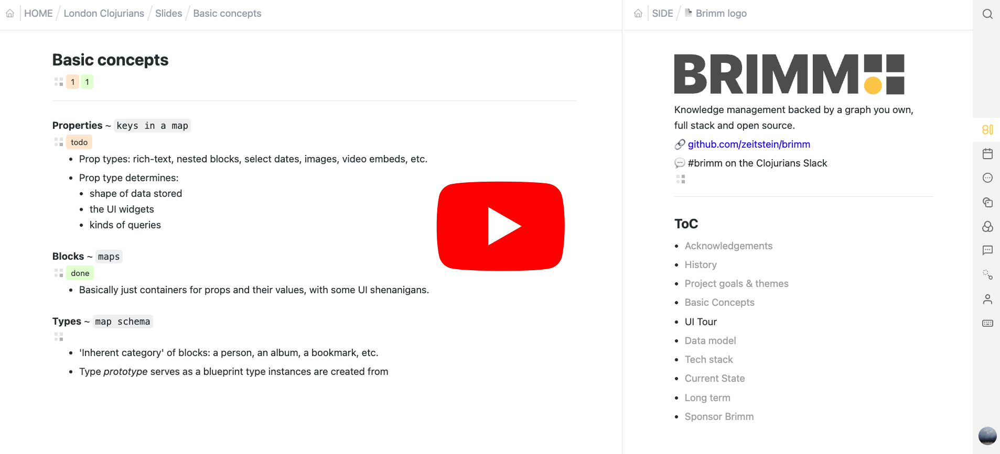

# Brimm

Notion-inspired versatile knowledge management backed by a graph you own, full stack and open source. Coming 2025.

> [!TIP]
> See Brimm in action (early 2024):
>
> 

More videos on my [YouTube channel](https://www.youtube.com/@filipjurukovic).

Feedback and suggestions are very welcome. Join the discussion on [GitHub](https://github.com/zeitstein/brimm/discussions) or in [#brimm](https://app.slack.com/client/T03RZGPFR/C05N8TX4YPM) on the Clojurians Slack.

## Sponsor Brimm

Please consider supporting Brimm’s development through [Github Sponsors](https://github.com/sponsors/zeitstein). Ideally I'll have enough funding to work on Brimm full-time. Thank you!

A big thank you to [JUXT](https://www.juxt.pro/) for their support and sponsorship, as well as to all the [sponsors](https://github.com/sponsors/zeitstein)!

## What

The shortest path to understanding **Brimm** is through its primary motivation: to combine Notion’s database and document editing experience with the structural flexibility of infinite outliners (apps like Workflowy or Logseq).

Brimm lets you model data as [blocks of many shapes](#how) (text, tasks, bookmarks, personal info, events, books, music albums, contact info, etc.), categorise and organise it, make connections, and search across it. You can mark a block as todo anywhere, then [create a table](#queries-and-views) listing all todos due today, whether from your entire database or a single project. You can list all paragraphs in need of revision from a blog post you’re writing. Or create a gallery of your favourite grunge albums.

Brimm is a [full-stack web app](#tech-stack), with the backend under the user’s control. Unlike Notion, you own your data. Brimm will be open source across the stack. And Brimm is [programmable](docs/user-guide.md#programmability).

The broader vision is to provide a capable personal/team graph database with a default UI. While the default interface covers many use cases, you *should* be able to work with your data through [other interfaces/applications](#embracing-the-backend).

Brimm is in active development, with a public release [planned for 2025](#when).

> [!TIP]
> Below you'll find some general and background info. You may wish to jump to the [User Guide](docs/user-guide.md) instead.

## How

See the [User Guide](docs/user-guide.md).

  
  

## When

Brimm is in active development. Open source local single-player is in beta testing; public release in 2025.

On the roadmap:

- Document history – should be straightforward to implement thanks to XTDB, need to figure out the UI
- Importing data from other apps – a good opportunity for *you* to help out!
- Collaboration
  - read/write permissions
  - granular user presence
- Hosting
  - make hosting in the cloud as easy as possible
  - harden the server
- UI improvements
  - new query views: kanban, gallery, timeline, etc.
  - I have a long list. Feel free to make suggestions!
- Using existing ontologies (e.g. schema.org)
- Server API
- Enable using Brimm as a CRM
- Possibly support other databases (XTDB v2, Datomic, etc.)

Please [vote](https://github.com/zeitstein/brimm/discussions/categories/polls) on what you'd like me to work on. Feel free to suggest something not on the list!

## Why

Notion has a beautiful document editing experience and its databases are a great tool for modelling and managing structured data. However, in my experience, Notion is not flexible enough for complex work – the document structure is not sufficiently granular. Additionally, pages can have properties only if they live in a Notion database which silos your data: you cannot mark a paragraph inside a document as todo nor could you get a table view of all of todos across your workspace.

Outliners excel at matching your thought flow – nesting and linking provide a robust way of structuring your data.

When I started thinking about and building Brimm, I wasn’t aware of any applications that combined these features. This is no longer quite true: Tana has a somewhat similar core design and Logseq has enabled adding properties to its blocks, to name a few I’m familiar with.

Here is what Brimm brings to the table.

### Going beyond outliners and documents

The “graph of nodes with properties” structure can model many kinds of data and Brimm leans into it. As a starting point, Brimm recognises that the information we work with comes in many shapes: text, tasks, bookmarks, contact info, events, books, music albums and so on.

Beyond that, I think interfaces/features like those of, say, Reddit or Twitter can be naturally modelled with this architecture. For instance, hosting Brimm’s documentation, project management and forums through the default Brimm UI (enabling situated discussions and transparent references to what is being discussed) seems within reach.

### Placing the user in control

Open source across the stack. Brimm can run entirely locally on your machine. If I were to stop supporting Brimm, you could continue using it without needing to migrate to another app. (If you do want to migrate, being completely in control helps!) Being open source also increases the likelihood of community maintenance (and extension).

Another important kind of user control in Brimm is [programmability](docs/user-guide.md#programmability).

### Embracing the backend

I see a lot of benefits to making your personal or team data accessible through various applications. For example:

- Even though you should be able to publicly expose your default Brimm application, you might instead wish to use the default UI as a sort of headless CMS, while rendering your data as a static website. (WordPress, personal blogs, digital gardening.)
- You might create a simple scheduler UI, inserting appointments as blocks in Brimm, then view them through a calendar UI (or Brimm UI itself).
- Archive, categorise and search data from external APIs in a single place (e.g. email).

## Tech stack

Brimm is written in Clojure.

The central part is [XTDB](https://www.xtdb.com/), which I’ve chosen because it provides:

- flexible data modelling
- simple but powerful query language
- full database history
- customisable integration with Lucene for full-text search

The frontend is built with [shadow-grove](https://github.com/thheller/shadow-grove) and talks to the backend via WebSockets. Updates are mostly optimistically applied on the frontend, then synced to the server.

Server APIs are planned. I find [Atomic Architecture](https://www.juxt.pro/blog/atomic-architecture/) and [juxt-site](https://github.com/juxt-site/site) inspiring here.

## Acknowledgements

I would like to thank:

- [Sofija Marjanović](https://www.linkedin.com/in/sofija-marjanovic) who has supported this project from earliest seedlings, including discussions and design contributions.
- [Jeremy Taylor](https://github.com/refset) a kind and kindred spirit.
- [Pawel Ceranka](https://github.com/qazwsxpawel) and [Malcolm Sparks](https://github.com/malcolmsparks) for broadening my perspective.
- [Thomas Heller](https://github.com/thheller) for patient [shadow-grove](https://github.com/thheller/shadow-grove) discussions.

Brimm uses Tabler icons, see license in `resources/public/icons/tabler-license`.
