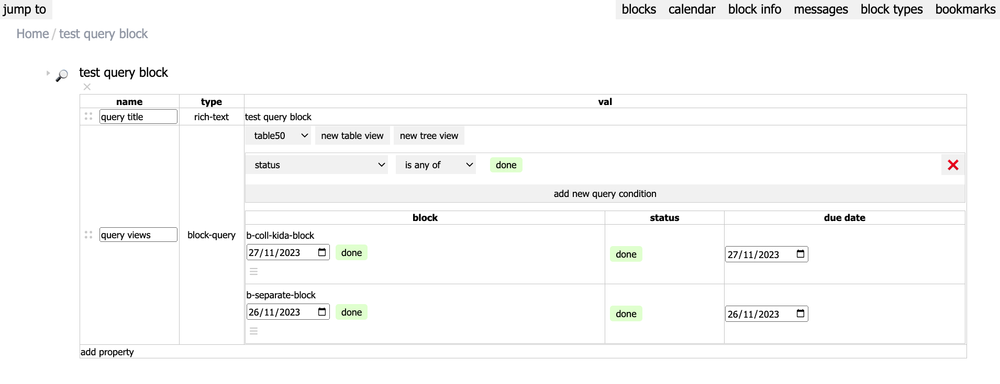
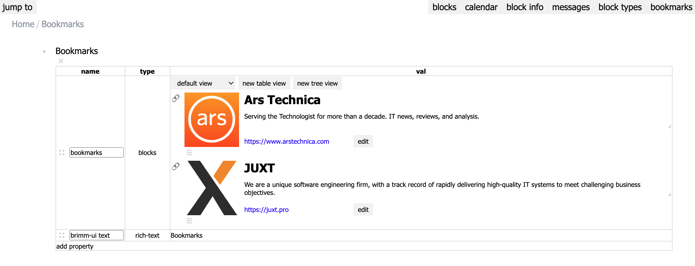

# Views and Queries

> [!TIP]
> For more context on views and queries, read the [relevant section of the readme](../README.md#queries-and-views).

Views bring together two functionalities:
- querying the database for blocks that match certain conditions
- displaying the results in various forms: table, kanban, etc.

In other words, each view may define a query and the visual layout of the query results.

Naturally for Brimm, views are exposed to the user through two property types: `:prop.type/block-query` and `:prop.type/blocks`.

### `:prop.type/block-query`

`block-query` prop type allows the user to query for blocks throughout the database and to create queries anywhere (by adding this prop to any block). There is a built-in block type, `query block`, with a prop of this type already attached for easy creation of live query blocks.

Where the views are defined for props of this type is somewhat complicated, but, I think justified, because it enables a multitude of use cases. You may save multiple views for a particular prop or a particular block.
- An optional set of default views may be defined on the prop itself (as `:prop/views`). This set will be copied every time the prop is added to a block.
- Thereafter, each block is free to change their copy of the default views. This copy is saved on the block (as the value of the prop).

Default views allow re-using views across blocks. For example, you may create a prop with a "table with all todos within this project" view and add it to all of your projects. On the other hand, being able to save views per block means you don't have to create a new prop every time you want to create a view. This is why the built-in `query block` type works.

Naturally, the currently active view may be defined on a per-prop or a per-block basis, using the same logic as above. The final complexity is necessitated by the concept of block mirroring, which enables a block to appear in multiple locations on the graph. While the set of views will be shared across all mirrors, a different view may be active for each mirror.

### `:prop.type/blocks`

This prop type models blocks containing other blocks (or nesting in traditional outliners). This type is similar to the `block-query` type in that both may be seen as defining a set of blocks: `block-query` through query results, `blocks` through nesting. Hence, we can re-use the view concept.

Views on `blocks` model "collections" or blocks that inherently fit together and 'live' in the same place, like a table with all of your bookmarks or all songs in an album. They resemble Notion's databases in this respect. All of this implies that queries of views for the `blocks` prop type have a limitation (in contrast with `block-query`): they only query within the set of blocks they contain. In other words, the queries may be thought of as filters on this pre-defined set.

Like `block-query`, the set of views may be defined on the prop. Unlike `block-query`, you cannot modify this set on each block. Example: if I have a prop listing the songs of an album, all albums will share the set of views for their songs. You may, however, activate a different view on each block.

Additionally, for this prop type there is a natural default view: displaying the ordered list of nested blocks as a tree (the default outliner/document view):

That is all for now re: views and queries. More details to follow.
