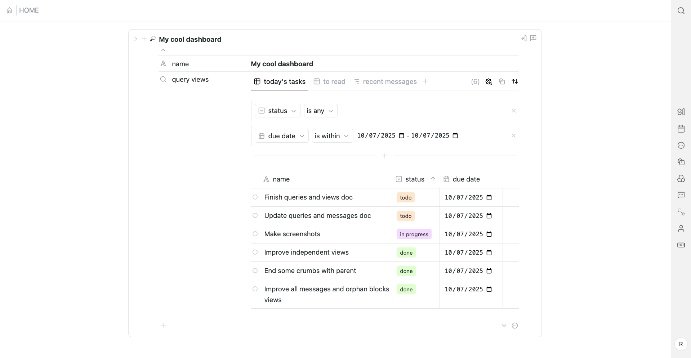
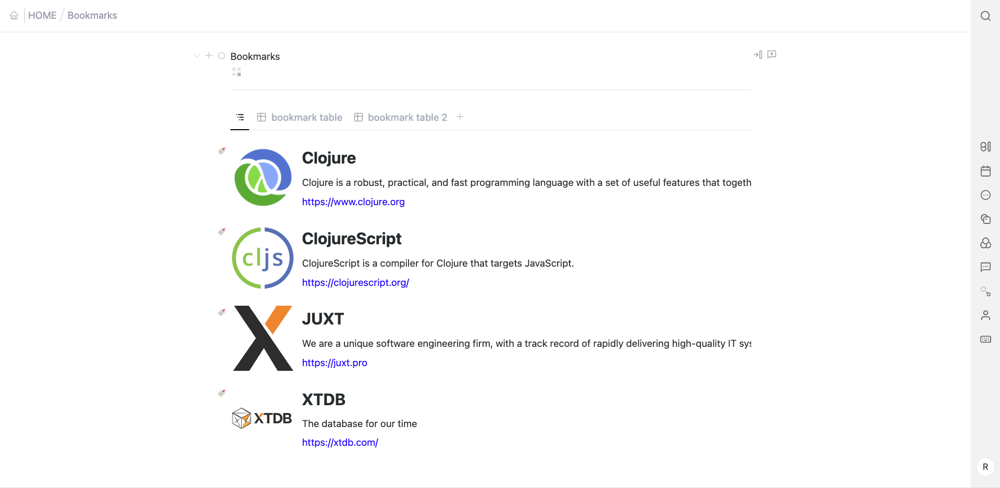

# Views and Queries

> [!TIP]
> For more context on views and queries see the [relevant section of the User Guide](user-guide.md#queries-and-views).

Views bring together two functionalities:
- querying the database for blocks that match certain conditions
- displaying the results in various forms: table, kanban, etc.

In other words, each view may define a query and the visual layout of the query results.

## Creating Views

Naturally for Brimm, views are available through two [property types](block-properties.md#property-value-types): `block-query` and `blocks`.

### block-query

`block-query` prop type allows the user to query for blocks throughout the database and to create queries anywhere (by adding this prop to any block). The [built-in block type](block-types.md#built-in-types) `query block` has a prop of this type already attached for easy creation of query views.

Where the views are defined for props of this type is somewhat complicated, but, I think justified, because it enables a multitude of use cases. You may save multiple views for a particular prop or a particular block.
- An optional set of default views may be defined on the prop itself (through the `views` attribute). This set will be copied every time the prop is added to a block.
- Thereafter, each block is free to change their copy of the default views. This copy is saved on the block (as the value of the prop).

Default views allow re-using views across blocks. For example, you may create a prop with a "table with all todos within this project" view and add it to all of your projects. On the other hand, being able to save views per block means you don't have to create a new prop every time you want to create a view. This is why the built-in `query block` type works.

Naturally, the currently active view may be defined on a per-prop or a per-block basis, using the same logic as above. Furthermore, the active view can be different for different UI locations. For example, the same block can have two different views active in the main and side panels.

### blocks

This [prop type](block-types.md#built-in-types) models blocks containing other blocks (or nesting in traditional outliners). This type is similar to the `block-query` type in that both may be seen as defining a set of blocks: `block-query` through query results, `blocks` through nesting. Hence, we can re-use the view concept.

Views on `blocks` model "collections" or blocks that inherently fit together and 'live' in the same place, like a table with all of your bookmarks or all songs in an album. They resemble Notion's databases in this respect. All of this implies that queries of views for the `blocks` prop type have a limitation (in contrast with `block-query`): they only query within the set of blocks they contain. In other words, the queries may be thought of as filters on this pre-defined set.

Like `block-query`, the set of views may be defined on the prop. Unlike `block-query`, you cannot modify this set on each block. Example: if I have a prop listing the songs of an album, all albums will share the set of views for their songs. You may, however, activate a different view on each block.

You can add views through the prop menu from a block or from the properties side panel.

Additionally, for this prop type there is a natural default view: displaying the ordered list of nested blocks as a tree (the default outliner/document view):

## View options

Top-left is the list of available views. Click a view to activate it. Drag views to reorder them. Right-click on a view for options:
- **name**
- **layout**
  - **tree** – the default layout used for the blocks prop type.
  - **table** – you can resize the columns, drag them to reorder and click for more options through the cells in the header.
  - TODO: kanban, list, gallery, timeline.
- **results per page**
- **full width** - maximizes the width of the results; only applicable for non-default views at panel roots in the [folding props](user-guide.md#ui-block-components) block part.

Options at top-right relate to the currently active view. The buttons from left-to-right are:
- Total **result count** and buttons to **page** through results.
- Show/hide **query conditions**.
  - These act as filters on the set of children (for blocks prop) or all blocks in the database (for block-query prop).
  - By default you work with conditions through the UI. The individual conditions are logically joined with `and`: the query results will match each condition. (Logic groups,`or`, `not` are TODO.)
  - You can also right-click on the toggle button to switch to [**raw XTDB query input**](https://v1-docs.xtdb.com/language-reference/1.24.3/datalog-queries/).
- **Display props** – choose which props and "special props" to display in the layout.
  - For example, these correspond to columns in the table layout.
- **Sort** – choose which props' values the results will be sorted by.
  - Currently you activate the sort through the header cell menu (but the prop doesn't need to be displayed to sort by it).
  - Can sort by multiple props, drag to reorder them (sorts by the first prop, then second, etc.).
- **Create new block** in the prop (`blocks` props only)
  - *Note*: the newly created block may not appear in results depending on query conditions.

