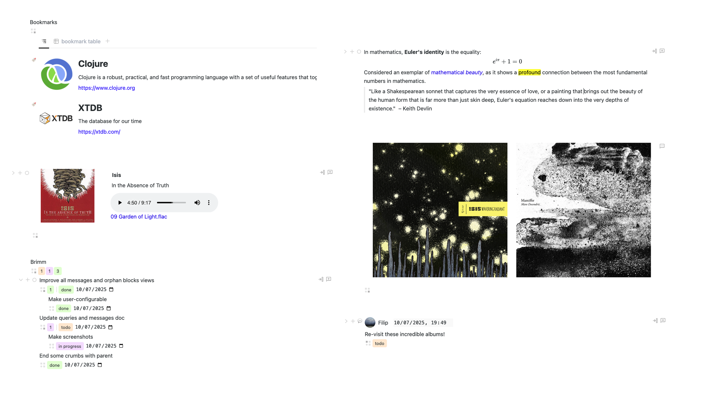

# Brimm User Guide

## How to Run

- Install JDK. Recommended version 21. (If you already have version 11+ installed, try it, it should work.)
  - You can check what version of Java you have installed by running `java -version` in a terminal.
  - Example JDK distribution: [Amazon Corretto](https://docs.aws.amazon.com/corretto/latest/corretto-21-ug/downloads-list.html).
- Unzipping should yield a `brimm` folder with `start-server` or `start-server.bat` executables. Your data (database and uploads) will be stored in this folder (unless otherwise configured).
- Double-click `start-server` and a terminal window should open. Browser tab will open after the server has started.
  - On first login, use the root email and passcode printed at the terminal.

> [!TIP]
> Brimm will add example blocks to your database on first run. You may explore them to see some of what's possible to do in Brimm. You may then delete them through the button in the root example block.

### Troubleshooting

- If running the executable doesn't work as expected, check the execute permission of the `start-server` executable.
- On Mac, if security warning on run, go to `Settings > Privacy & Security > Allow applications downloaded from > App Store` and identified developers and allow `start-server` to run.

### Configure

You may configure the server through the optional `config.edn` file located in the same directory as the `start-server` executable.

Options:
- `:http-port`
- `:https-port` – will start https only if this is present, requires keystore.
- `:keystore` – path to java keystore to use.
- `:key-password` – password for the keystore
- `:db` – path to the folder in which database files will be stored, default `./data`.
- `:open-in-browser?` – should open browser tab once server starts, default `true`.

### Updating

- Shut down your server.
- Backup your `brimm` folder (especially the `data` folder)
- Unzip the new `start-server` executable into your existing `brimm` folder.

## Basic Concepts

### Blocks, Properties and Types

The two fundamental entities in Brimm are **properties** and **blocks**.

- Properties ("props" for short) model individual pieces of data (the release date, the band, the genres, the songs), defining the type of their values (a date, a reference to a block, multiple enumerated values, nested blocks).
- Blocks bring coherent pieces of data together (the album).

From this perspective, the standard outliner note is simply a block with a text property and a property pointing to notes nested within it. However, other kinds of data needn’t have these properties nor the same visual representation.

In Brimm, you can add arbitrary properties to a block and define how the properties are laid out in the UI. You can create **block types** that instantiate properties and **layouts** together. Indeed, in Brimm, the outliner note is a special block type (well, kind of).

> [!TIP]
> Read in-depth about [properties](block-properties.md) and [types](block-types.md).

Examples of blocks:

### Queries and Views

Now that you have this data in your database, you can query for it in various ways!

The most interesting is through **views**: live user-defined query results displayed in the form of tables, kanban boards, etc. Views may be added to any block. For example, you may create a table of all project todos (which are located anywhere inside the project) at the top of your project. Or you may create a dashboard-like experience on the Home 'page', grouping together several commonly used views, for example:

Needless to say, Notion’s databases have been a guiding implementation. Importantly, Brimm views can query/filter blocks across your whole database, not just a single "database" like in Notion.

> [!TIP]
> Read more about queries and views [here](queries-and-views.md).

### Programmability

Brimm seeks to be a general-purpose tool, which implies it may not handle any specific task or workflow well. For this reason Brimm was made to be programmable (with Clojure via [SCI](https://github.com/babashka/sci) scripts).

> [!TIP]
> See the [custom](block-properties.md/#custom) and [server-tx](block-properties.md/#server-tx) prop types. Also see the scripting opportunities during [block type instantiation](block-types.md/#prototype).

<!-- ! update -->

A couple of examples:

- Writing a server-side script to do an HTTP request fetching relevant info and change the layout for the bookmark block type. (You can see this script in your UI!)

https://github.com/zeitstein/brimm/assets/8146007/cc7ea3a9-0193-4bdd-a078-3dd5d6a1c7af

- Deriving facts (either on read or on transaction)

https://github.com/zeitstein/brimm/assets/8146007/bbc31a53-4cc1-4ee4-9108-075de8519315

## UI Tour

> [!TIP]
> Many interactive elements (such as buttons, menu items, etc.) show a helpful tooltip on hover.

> [!TIP]
> Brimm doesn't hijack the `Tab` key for block indentation. Use it to move between UI elements.

### Block UI

#### UI Block Components

- **Prop grid layout** – always visible grid of block prop values.
  - Defined through the layout editor in [Block Info](#block-info).
  - Props may occupy adjacent cells as long as they form a rectangle (same as CSS grid, if you're familiar).
  - You can further tweak the layout via the style attribute (as EDN), e.g. `{:gap "10px" :border "1px solid red"}`.

- **Pinned props** – always visible "strip" of block prop values.
  - Any prop may be pinned through the block menu or props table prop menu.

- **Folding props** – block prop values which can be expanded/collapsed via the toggle button to the left of a block.
  - Any prop may be added to folding props through the block menu or props table prop menu.
  - When a block has multiple folding props, it will show prop names as headings in addition to the prop val.

- **Block props table** – lists all the properties (and property-like keys) of the block.
  - The button which toggles it is at the start of the pinned props "strip" (and displays useful info both through its state and on hover).
  - You can reorder the properties by dragging by the prop icon. You can select (`Ctrl/Cmd`-click) multiple props to drag together.
  - The buttons at bottom of the table:
    - add (existing/new) prop to block
    - show system props (created at/by, modified at/by)
    - show [Block Info](#block-info) below the table.

#### Drag and select blocks

- Drag blocks by their icons to move, add (hold `Ctrl/Cmd`) or copy (hold `Alt`) them.
- `Ctrl/Cmd`-click a block to select it. You may select multiple blocks to drag or right-click to open the menu with block actions.

### Main panel

The UI is split between the **main** and **side panels**.

The main panel is the left-hand side block panel. The path crumbs at the top show the ancestry of currently opened ("zoomed in") block. The home icon in crumbs navigates to the **main root block**.

The right-hand side bar buttons/panels are as follows:

### Jump To

A modal to quickly search through your database. Opened via the search button at the top of the side bar or via keyboard shortcuts.

Opens the selected item in main or side (by holding down `Ctrl/Cmd`) panel on click or `Enter`.

Search strings starting with `:` followed by a space are passed raw directly to Lucene and can use its [query syntax](https://lucene.apache.org/core/2_9_4/queryparsersyntax.html).

### Side Blocks

Similar to the main panel, except the home is the **side root block**. Useful when wanting to work on blocks side-by-side, etc.

Blocks may be added to the side root block and removed from it. There are a couple of buttons on the right-hand side of blocks to facilitate this, but the side root is a regular block so you can use the other available methods of moving blocks.

### Calendar

Useful for daily notes and keeping track of what was modified on a particular calendar date.

The "days" are simply blocks of a [built-in block type](block-types.md#built-in-types). They are instantiated when navigating through the calendar from the side panel.

> [!TIP]
> You may edit the [prototype](block-types.md#prototype) to customise day blocks!

### Block Info

May be opened from the block props table or as a side panel. Brings together all non prop-related info about a block like:
- backlinks
- locations
- name prop – the value of which property to use as the name of the block (e.g. in breadcrumbs or tables)
- prop grid layout editor
- [template](block-types.md#prototype)-related SCI scripts
- and more...

### Block Properties

See [block properties](block-properties.md) for more info.

### Block Types

See [block types](block-types.md) for more info.

In the top-right of the Block Type side panel you may choose the **default block type** of newly created blocks. The default is `none` which just creates paragraph-like (standard outliner) blocks (which are technically type-less).

### Messages

Messages are simply blocks of a [built-in type](block-types.md#built-in-types).

There's a convenient button for adding messages on the right-hand side of blocks.

The messages side panel displays a tree of **messages** for a particular block or an editable [view](queries-and-views.md) of all messages.

> [!TIP]
> Messages are in a proof-of-concept stage. Being a block, you can add any property to them (e.g. mark them as todo) or change their prototype! We also get threads and queries for free! I think this is both simple and powerful.
>
> But they are missing the more conventional "draft then submit" UX, they should only be editable by the user which created them, etc. I plan on adding those features as part of a general push to make Brimm more [collaboration-ready](#users-and-collaboration).

### Orphan Blocks

An editable [view](queries-and-views.md) of all blocks without a parent.

### Users

Manage [users](#users-and-collaboration).

### Keyboard Shortcuts

Lists keyboard shortcuts. (Currently read-only.)

### Connected Users

Avatars of [connected users](#users-and-collaboration) are displayed at the bottom of the side bar. The signed-in user is bottom-most. Its avatar shows a spinner around it when there are changes pending to be synced to the server. (You may click on the avatar to force immediate sync.)

## Uploading Files

Files can be uploaded by dragging into a blocks prop, or dragging or pasting into a rich-text editor. A block of the [built-in type](block-types.md#built-in-types) file is created for each file uploaded.

The files are visualised in the UI based on their MIME type:
- images, video and audio render as native HTML widgets
- other file types render their filename as links

## Users and Collaboration

You can give access to your database through the Brimm UI by creating user accounts through [the side panel](#users). Database changes are streamed to all [connected users](#connected-users). This enables real-time collaboration.

Currently all users have read/write access to the entire database. This might be fine for some teams, but is obviously far from the norm/ideal. More robust collaboration is planned.

> [!TIP]
> If you're a part of a team wanting better collaboration in Brimm, please reach out and consider [sponsoring](https://github.com/sponsors/zeitstein)!

## Hosting

I'd like to provide a simple path to self-hosting the Brimm server in the cloud. But the focus of the initial release has been the single player experience.

For the adventurous, it should certainly be possible as the code and the jar are available (also see [config](#configure)).

An easier alternative I've been using in the meantime is exposing the local instance through [tunnelling](https://github.com/anderspitman/awesome-tunneling).

## Data Model

If you want to [program](#programmability) Brimm or work with your data outside of the Brimm UI, you should know a bit about the underlying data model.

Any kind of entity in Brimm (e.g. blocks, props, types, users) is modelled as a Clojure map or [*document*](https://v1-docs.xtdb.com/language-reference/datalog-transactions/#document) in XTDB parlance. Their `:xt/id` may be any valid XTDB id, except for props whose ids must be `keyword`s (due to the model and XTDB's limitation of only supporting `keyword`s keys in documents). Brimm uses UUIDs for the ids it generates.

In [user scripts](user-guide.md#programmability), one usually only works with blocks. Blocks are Clojure maps and:
- Most of their keys are the `keyword` ids of its properties.
- The values of prop keys depend on the [prop type](block-properties.md#property-value-types).
- Brimm UI specific block data is grouped in the `:brimm.block/ui` map. (The individual keys in this map won't be indexed by XTDB and so won't pollute your DB index individually.)

Property ids are derived from their names upon creation. For example, the name "description" would yield `:description`, "bookmark/url" `:bookmark/url`. You may change the id after creation from the [properties side panel](#block-properties).

> [!TIP]
> You can see the EDN data underlying blocks in [Blocks Info](user-guide.md#block-info) and props in the [props side panel](user-guide.md#block-properties). Block types are really mostly about the [prototype](block-types.md#prototype), which is a block.

> [!TIP]
> Useful code namespaces: `brimm.model.spec` and `brimm.model.base-data`. Browsing the latter can be especially helpful. Recommend looking at the bookmark and calendar day types as good non-trivial examples.
